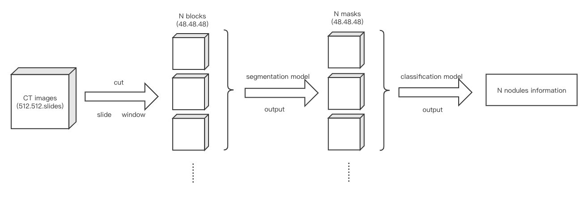
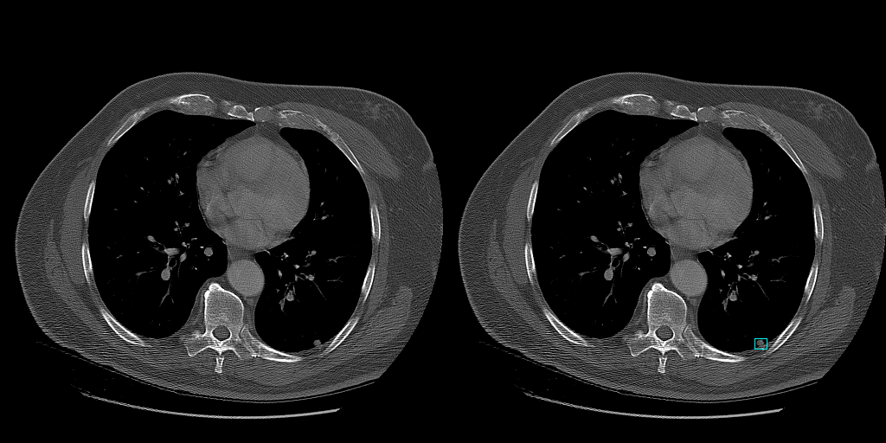
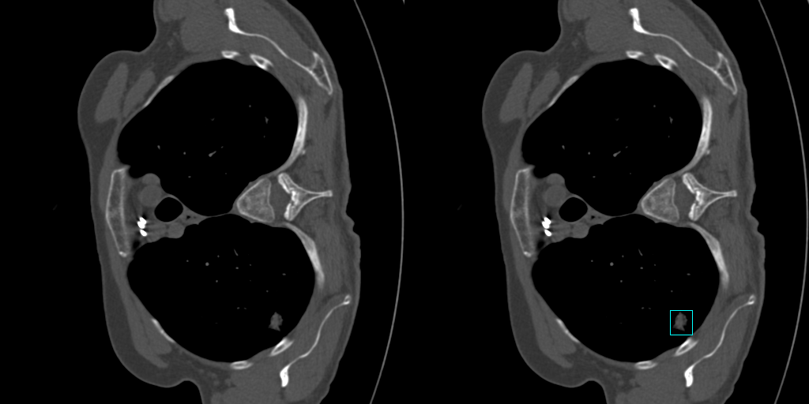

# Lung_nodule_detection
Detection of lung nodules based on CT images 

all codes run in pytorch version = 1.1 and python3.5

Lung nodule detection is a classic case of artificial intelligence Application in medical field. A good algorithm helps doctor diagnose the lung illness. The following is my algorithm steps that check lung nodules from creating dataset and building neural network, finally I train the model and get a desired result.



## Datasets
The dateset is [LUNA16](http://academictorrents.com/collection/luna-lung-nodule-analysis-16---isbi-2016-challenge), including 888 CT images (MHD format), and each CT images have multiple axial slices of the chest (512 512 slices). Therefore, this is a 3-D deep learning problem. The label information of LUNA16 is based on every lung nodule, which has center point coordinates and its radius.

In deep learning, 3-D CT images use corresponding 3-D convolution kernel, so I build a 3-D neural network by modifying Resnet and U-net to apply to 3-D images in pytorch framework. But 3-D modifying need consume lots of GPU graphics memories. It will raise a 'out of memory' error if putting raw CT images in network to train directly, for solving this problem, I cut CT images from (512 512 slices) to (48,48,48) and use slide window to cover the whole CT images.

## Network structure
In my method, the lung nodule detection is two-stage task, the first stage is making a preliminary screening for lung nodule by U-net segmentation network ((48,48,48) slide window input), and the second stage is further screening by Resnet classification network ((48,48,48) input).



## Data prepare
In segmentation network, the center point coordinates of lung nodules is as a center of (48,48,48) block, at the same time, it is allowed to add a random bias, and the target is a 0-1 mask, also (48,48,48) block, which nodule area is set 1 and rest of area is set 0  according to coordinates information from label. Thus, we get masks as targets to calculate loss.

In classification network, the nodules area is cut to (48,48,48) blocks as positive samples and the no-nodules area is alao cut randomly to (48,48,48) blocks as negitive samples, ensure the balance of positive samples and negitive samples.

The following is dataset demo, you can find it in dir `./data`.

 
 
 ## Starting Training
 After data prepare, find './config.py' file, modify parameters and execute the following command:
 ``` bash
python3 ./train.py
```
Usually, it takes long time for training, when the training ends up, weights file will be generated in path `./save/`, and this file contain weights information of model.

## Inference
when the training ends, we choose the best perference segmentation and classification models in test dataset for inference. For example, there is a CT images which size is 512 and slices is 128, so this (512,512,128) blocks is divided into several (48,48,48) blocks and send to the network gradually. On first stage, proposal nodules are found, on second stage Judge those accurately. Finally, we get the position information of lung nodules and show it in slice picture.

## results
in LUNA16 datasets, the above method get a result:

recall = 81% 

precision = 48%


